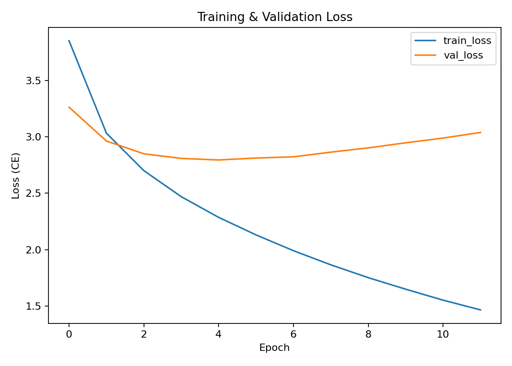
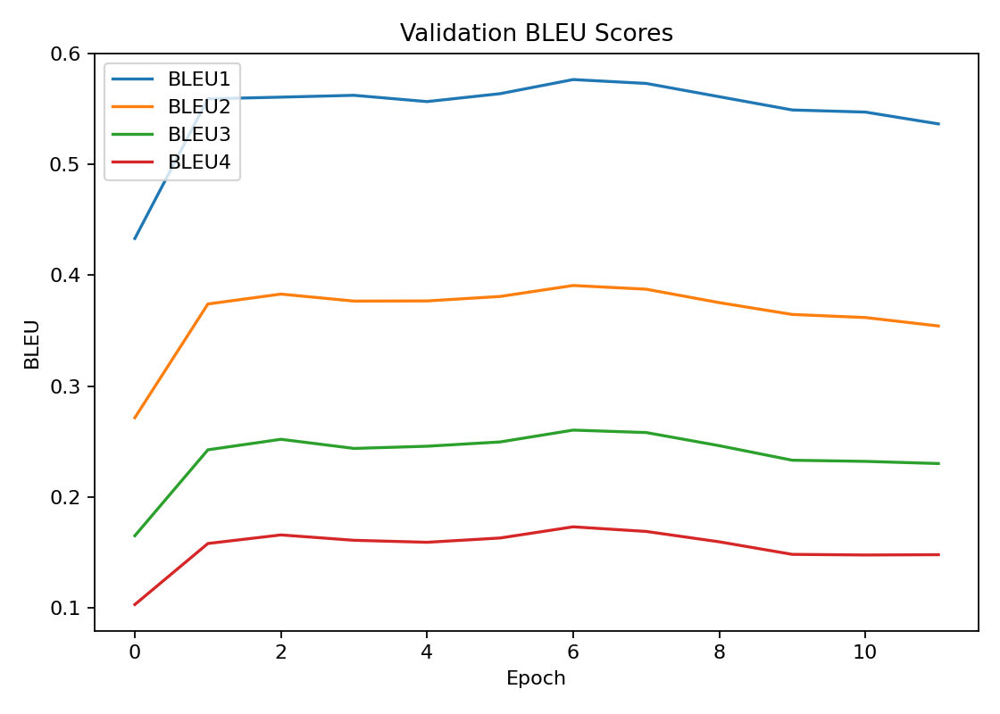
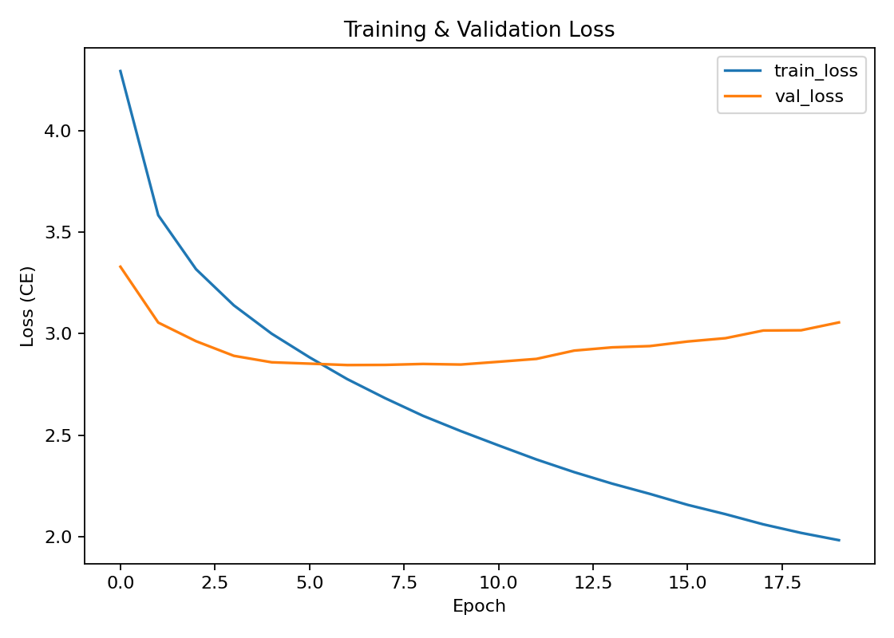
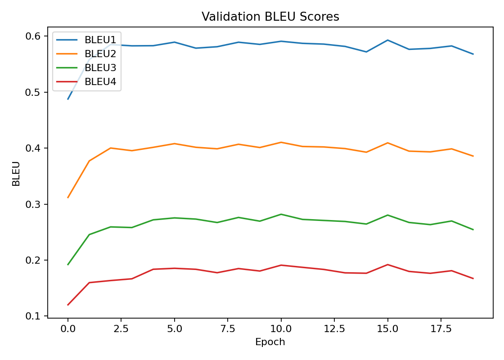

# Image Caption Generator

A deep learning project that generates natural-language captions for images, with a **React/Vite web app** and a **FastAPI backend** on top of the trained models. It supports two caption decoders (a **CNN-LSTM baseline** and a **CNN + visual-attention "Show, Attend and Tell" decoder**), caption **translation** into other languages, and **text-to-speech** playback of the result.

---

## Table of Contents

- [Project Overview](#project-overview)
- [Objectives](#objectives)
- [Key Features](#key-features)
- [Architecture](#architecture)
- [Web Application](#web-application)
- [Technologies](#technologies)
- [Project Structure](#project-structure)
- [Dataset Format](#dataset-format)
- [Model & Training Details](#model--training-details)
- [Results](#results)
- [Setup](#setup)
- [Running the Project](#running-the-project)
- [Testing](#testing)
- [Limitations](#limitations)
- [License](#license)

---

## Project Overview

Image captioning connects computer vision and language generation: given an input image, a model produces a text description of its visual content. This repository implements that pipeline end-to-end in PyTorch — from vocabulary building and dataset loading, through training and BLEU evaluation, to a runnable web application — and ships two encoder/decoder variants that share the same training and inference code paths:

- **Baseline decoder**: a ResNet-50 encoder pooled into a single feature vector, decoded by a plain LSTM.
- **Attention decoder**: a ResNet-50 encoder that keeps its spatial feature grid, decoded by an LSTM with Bahdanau-style visual attention (*Show, Attend and Tell*).

Both variants have been trained, and their checkpoints' metrics, BLEU/loss curves, and sample predictions are committed under `outputs_baseline/` and `outputs_attention/` (the raw `.pt` checkpoint weights themselves are excluded from version control via `.gitignore`).

---

## Objectives

- Provide a clean, reproducible CNN-LSTM image-captioning training and evaluation pipeline in PyTorch.
- Offer an optional attention-based decoder as a stronger alternative to the plain LSTM baseline, using shared code paths for training/evaluation/inference.
- Evaluate generated captions quantitatively with corpus BLEU-1 through BLEU-4 against grouped multi-reference captions.
- Wrap the trained models in a usable product: a FastAPI backend and a React web frontend that generate, translate, and speak captions for user-uploaded images.

---

## Key Features

- **CNN encoder** — ResNet-50 backbone (`torchvision`), pretrained by default, with an option to fine-tune the backbone (`--train-backbone`).
- **Two decoder architectures**, selected with `--decoder lstm` (default) or `--decoder attention`:
  - `DecoderLSTM` — LSTM decoder with **greedy decoding** and **beam search**.
  - `AttentionDecoderLSTM` — LSTM decoder with additive attention over the encoder's spatial feature grid, trained with a doubly-stochastic attention regularizer (`--alpha-c`); greedy decoding only.
- **Custom vocabulary builder** with minimum-frequency filtering and JSON serialization (`Vocabulary` in `src/utils.py`).
- **Multi-reference BLEU evaluation** (BLEU-1–4, via NLTK) that groups multiple caption rows for the same image into one reference set.
- **Training utilities**: gradient clipping, early stopping on validation BLEU-4, automatic checkpoint/vocab/metrics export, and saved loss/BLEU charts (`matplotlib`).
- **Sample prediction export** to JSON and CSV for manual inspection of test-set generations vs. references.
- **Caption translation** into a user-specified language via `deep-translator`'s `MyMemoryTranslator`.
- **Text-to-speech** of the (translated) caption via `gTTS`.
- **Flickr-style dataset converter** (`scripts/prepare_flickr_csv.py`) that turns raw Flickr-style caption files into the CSV format this project expects, with a randomized train/val/test split.
- **FastAPI backend** exposing a single-image captioning endpoint that returns the caption, its translation, and a link to the generated audio file.
- **React (Vite) frontend** — a three-step guided UI (upload → configure → result) for trying the model in a browser.
- **Pytest suite** (`tests/test_core.py`) covering vocabulary I/O, BLEU scoring, decoder shapes/alignment, beam search determinism, and the attention decoder's shapes, attention-weight normalization, and ability to overfit a tiny batch.

---

## Architecture

```text
Image
  │
  ▼
CNN Encoder (ResNet-50)
  │
  ▼
Image Feature(s)                 (pooled vector for the baseline decoder,
  │                                spatial 7x7 feature grid for the attention decoder)
  ▼
LSTM Decoder (optional attention)
  │
  ▼
Generated Caption  ──►  Translation (optional)  ──►  Text-to-Speech (optional)
```

### CNN Encoders (`src/models.py`)

- `EncoderCNN` removes ResNet-50's final classification layer, flattens the pooled 2048-d feature, and projects it (Linear + LayerNorm + ReLU) into the decoder's embedding dimension. Used by the baseline decoder.
- `EncoderCNNAttention` removes ResNet-50's average-pool and fc layers, keeping the convolutional feature map, then adaptively pools it to a fixed spatial grid (default 7×7) and reshapes it to `(batch, num_pixels, 2048)`. Used by the attention decoder.
- Both freeze the ResNet backbone by default; `--train-backbone` makes it trainable.

### Baseline Decoder — `DecoderLSTM`

The encoder's image feature is fed as the first LSTM input, followed by the caption's word embeddings (teacher forcing during training). At inference, `sample()` performs **greedy decoding** and `beam_search()` performs **beam search** (batch size 1, with length-penalty-normalized scoring).

### Attention Decoder — `AttentionDecoderLSTM` ("Show, Attend and Tell")

An `Attention` module (additive/Bahdanau attention) computes a distribution over the encoder's spatial locations at every decoding step and produces a context vector as their weighted sum. The LSTM cell's hidden state is initialized from the mean encoder feature; at each step the token embedding is concatenated with a gated attention context (`f_beta`) and fed through an `LSTMCell`. Training adds a doubly-stochastic regularization term (`alpha_c * (1 - sum_t alpha)^2`) that encourages the attention weights to sum to 1 across time for each spatial location. `sample()` performs greedy decoding; beam search is not implemented for this decoder (inference falls back to greedy with a warning if `--beam-size` is set).

### Decoding Strategies

| Strategy | Description | Availability |
|---|---|---|
| Greedy | Picks the highest-probability token at every step | Both decoders |
| Beam search | Keeps the top-`k` candidate sequences, expands them, and selects the best length-normalized sequence | Baseline (`DecoderLSTM`) only |

---

## Web Application

A small full-stack app (`backend/`, `frontend/`) wraps the trained checkpoints:

**Backend (`backend/app.py`, FastAPI)**
- Loads the baseline and/or attention checkpoint from `outputs_baseline/` / `outputs_attention/` on first use and caches it in memory.
- `POST /generate` — accepts a multipart image upload plus `model` (`"baseline"` or `"attention"`, default `"attention"`) and `language` (default `"english"`) form fields. Generates a caption, translates it if a non-English language is requested, synthesizes speech for the result with `gTTS`, and returns `{ caption, translation, audio_url, model, language }`.
- `GET /audio/{filename}` — serves a previously generated `.mp3` from `outputs_audio/`.
- `GET /` — health check.
- CORS is open to all origins.

**Frontend (`frontend/`, React 19 + Vite)**
- A single-page "VisionCaption" UI with a three-step draggable carousel: **01 Upload** an image, **02 Configure** the model (Attention/Baseline) and target language, **03 Result** — shows the generated caption, its translation, and an audio player with a download link.
- Talks to the backend at `http://127.0.0.1:8000` (hardcoded `API_BASE` in `src/App.jsx`).
- Built with `react`, `react-dom`, and `lucide-react` icons; linted with ESLint (flat config).

> `fastapi`, `uvicorn`, and `python-multipart` are required to run the backend but are **not** listed in `requirements.txt` — install them separately (see [Setup](#setup)).

---

## Technologies

| Category | Technology |
|---|---|
| Language | Python 3.10+ |
| Deep learning | PyTorch 2.2, Torchvision 0.17 (ResNet-50) |
| NLP | NLTK (tokenization, BLEU scoring) |
| Data handling | pandas, NumPy, Pillow |
| Charting | Matplotlib |
| Translation | deep-translator (`MyMemoryTranslator`) |
| Text-to-speech | gTTS |
| Backend API | FastAPI, Uvicorn (implied by `backend/app.py`) |
| Frontend | React 19, Vite 8, lucide-react |
| Testing / QA | pytest |
| Progress bars | tqdm |

---

## Project Structure

```text
image-caption-generator/
├── backend/
│   └── app.py                     # FastAPI captioning/translation/TTS API
├── frontend/                      # React + Vite web UI ("VisionCaption")
│   ├── public/
│   ├── src/
│   │   ├── App.jsx
│   │   ├── App.css
│   │   ├── index.css
│   │   ├── main.jsx
│   │   └── assets/
│   ├── index.html
│   ├── package.json
│   ├── vite.config.js
│   └── eslint.config.js
├── outputs_attention/             # Committed results from the attention decoder run
│   ├── bleu_scores.png
│   ├── metrics.json
│   ├── sample_predictions.csv
│   ├── sample_predictions.json
│   ├── training_curves.png
│   └── vocab.json
├── outputs_baseline/              # Committed results from the baseline LSTM decoder run
│   ├── bleu_scores.png
│   ├── metrics.json
│   ├── sample_predictions.csv
│   ├── sample_predictions.json
│   ├── training_curves.png
│   └── vocab.json
├── scripts/
│   └── prepare_flickr_csv.py      # Convert Flickr-style caption files to the project CSV format
├── src/
│   ├── infer.py                   # Single-image inference (caption + translate + TTS)
│   ├── models.py                  # Encoders, LSTM decoder, attention decoder, beam search
│   ├── text_to_speech.py          # gTTS wrapper
│   ├── train.py                   # Training loop, evaluation, checkpoint/metric export
│   ├── translator.py              # deep-translator wrapper
│   └── utils.py                   # Vocabulary, dataset, collation, BLEU helpers
├── tests/
│   └── test_core.py               # Pytest suite
├── .gitignore
├── LICENSE
├── pyproject.toml                 # pytest/ruff/black/mypy configuration
├── requirements.txt
├── requirements-dev.txt
└── README.md
```

`best_captioner.pt` checkpoint files (produced by training) and `outputs_audio/` (produced by the backend at request time) are intentionally excluded from the repository via `.gitignore`.

---

## Dataset Format

`src/train.py` expects a CSV file with three columns:

```csv
image_path,caption,split
Images/1000268201_693b08cb0e.jpg,a child in a pink dress is climbing up a set of stairs,train
Images/1000268201_693b08cb0e.jpg,a girl going into a wooden building,train
Images/1001773457_577c3a7d70.jpg,a black dog and a spotted dog are fighting,val
Images/1002674143_1b742ab4b8.jpg,a little girl covered in paint sits in front of a painted rainbow,test
```

| Column | Description |
|---|---|
| `image_path` | Path to the image, relative to `--images-root` |
| `caption` | Text caption for that image |
| `split` | `train`, `val`, or `test` |

Multiple rows can share the same `image_path`; during evaluation these are grouped into one multi-reference set per image for BLEU scoring (`references_by_image` in `src/train.py`). For Flickr-style caption files (`image.jpg#0\tcaption text` or `image.jpg,caption text`), `scripts/prepare_flickr_csv.py` converts them into this CSV format and assigns a random 80/10/10 train/val/test split.

This repository does not ship a dataset or images. The image filenames referenced in `outputs_baseline/sample_predictions.csv` and `outputs_attention/sample_predictions.csv` (e.g. `Images/1003163366_44323f5815.jpg`), together with the `prepare_flickr_csv.py` converter, indicate the committed results were produced by training on a Flickr8k-style captioned image dataset (5 captions per image; the test split covers 810 images / 4,050 caption samples per `metrics.json`).

---

## Model & Training Details

Training is driven by `src/train.py`. For each epoch it:

1. Runs a forward/backward pass over the training split (`compute_loss` in `src/train.py`), using cross-entropy loss with `ignore_index=0` (the `<pad>` token). For the attention decoder, the doubly-stochastic regularization term is added when `--alpha-c > 0`.
2. Optionally clips gradients to `--grad-clip` (default `1.0`).
3. Evaluates on the validation split: loss and BLEU-1–4 (`evaluate()`), deduplicating repeated images so each is scored once.
4. Saves a checkpoint (`outputs/best_captioner.pt` by default) whenever validation BLEU-4 improves by at least `--early-stopping-min-delta`, and stops early after `--early-stopping-patience` epochs without improvement (disabled by default).
5. Writes `training_curves.png` (train/val loss) and `bleu_scores.png` (val BLEU-1–4) after every epoch.

After training, if a test split exists, the best checkpoint is reloaded and evaluated on it, and per-image predictions are saved to `sample_predictions.json` / `sample_predictions.csv`. Final metrics (best validation BLEU-4, best epoch, full per-epoch history, and test metrics) are written to `metrics.json`.

Checkpoints store everything needed to rebuild the exact architecture at inference time: `decoder_type` (`lstm` or `attention`), `embed_dim`, `hidden_dim`, `num_layers`, `dropout`, `attention_dim`, `encoder_dim`, `image_size`, `train_backbone`, and the encoder/decoder `state_dict`s — so `src/infer.py` and `backend/app.py` never need to be told which architecture a checkpoint uses.

### Selected training arguments (`src/train.py`)

| Argument | Default | Description |
|---|---|---|
| `--captions` | *required* | Path to the captions CSV |
| `--images-root` | `data` | Root directory for image paths |
| `--outdir` | `outputs` | Output directory for checkpoint/vocab/metrics/charts |
| `--epochs` | `10` | Training epochs |
| `--batch-size` | `64` | Batch size |
| `--embed-dim` | `256` | Embedding dimension |
| `--hidden-dim` | `512` | LSTM hidden dimension |
| `--num-layers` | `1` | LSTM layers (baseline decoder only) |
| `--dropout` | `0.1` | Dropout probability |
| `--min-freq` | `3` | Minimum word frequency to enter the vocabulary |
| `--max-len` | `20` | Maximum caption length |
| `--lr` | `1e-3` | Learning rate (Adam) |
| `--decoder` | `lstm` | `lstm` or `attention` |
| `--attention-dim` | `256` | Attention hidden size (attention decoder only) |
| `--alpha-c` | `1.0` | Doubly-stochastic attention regularization weight |
| `--grad-clip` | `1.0` | Max gradient norm (`0` disables) |
| `--early-stopping-patience` | `0` | Epochs without BLEU-4 improvement before stopping (`0` disables) |
| `--train-backbone` | off | Fine-tune the ResNet-50 backbone |
| `--pretrained` / `--no-pretrained` | on | Use pretrained ResNet-50 weights |

---

## Results

The committed `outputs_baseline/metrics.json` and `outputs_attention/metrics.json` report the following:

| Metric | Baseline (`lstm`) | Attention (`attention`) |
|---|---|---|
| Best validation BLEU-4 | 0.1730 | 0.1919 |
| Best epoch | 7 (of 12 trained) | 16 (of 20 trained) |
| Test BLEU-1 | 0.5742 | 0.5874 |
| Test BLEU-2 | 0.3897 | 0.4043 |
| Test BLEU-3 | 0.2578 | 0.2695 |
| Test BLEU-4 | 0.1691 | 0.1767 |
| Test loss | 2.8467 | 2.9843 |
| Test set size | 810 images / 4,050 samples | 810 images / 4,050 samples |

The attention decoder outperforms the baseline LSTM decoder on every BLEU order in this run.

<div align="center">

| Baseline — Loss | Baseline — BLEU |
|---|---|
|  |  |

| Attention — Loss | Attention — BLEU |
|---|---|
|  |  |

</div>

Per-image generated captions vs. reference captions for both runs are in `outputs_baseline/sample_predictions.csv` / `outputs_attention/sample_predictions.csv` (and the equivalent `.json` files). Both vocabularies (`outputs_baseline/vocab.json`, `outputs_attention/vocab.json`) contain 3,651 entries.

---

## Setup

### 1. Clone your repository

```bash
git clone <your-repository-url>
cd image-caption-generator
```

### 2. Python environment

Requires Python 3.10+ (pinned dependency versions target 3.10).

```bash
python -m venv .venv
# Windows
.venv\Scripts\activate
# macOS/Linux
source .venv/bin/activate

pip install -r requirements.txt
```

For linting/formatting/type-checking/tests:

```bash
pip install -r requirements-dev.txt
```

The training/inference stack (`torch`, `torchvision`, `nltk`, `gTTS`, `deep-translator`, etc.) is pinned in `requirements.txt`. To also run the backend API, install FastAPI and its ASGI server, which are used by `backend/app.py` but not listed in `requirements.txt`:

```bash
pip install fastapi "uvicorn[standard]" python-multipart
```

NLTK's tokenizer resources (`punkt`) may need to be downloaded once; `src/utils.py` falls back to a whitespace tokenizer if they are unavailable.

### 3. Frontend environment

Requires Node.js.

```bash
cd frontend
npm install
```

---

## Running the Project

### Train a model

```bash
python src/train.py --captions <path-to-captions.csv> --images-root <images-root> --epochs 20 --early-stopping-patience 5
```

Add `--decoder attention` to train the attention decoder instead of the baseline. This produces `outputs/best_captioner.pt`, `outputs/vocab.json`, `outputs/metrics.json`, `outputs/sample_predictions.{json,csv}`, `outputs/training_curves.png`, and `outputs/bleu_scores.png`.

To convert a Flickr-style caption file into the expected CSV first:

```bash
python scripts/prepare_flickr_csv.py --captions-file Flickr8k.token.txt --images-subdir Images --output captions.csv
```

### Run inference from the command line

```bash
python src/infer.py --checkpoint outputs/best_captioner.pt --vocab outputs/vocab.json --image path/to/image.jpg --max-len 20
```

Options: `--beam-size N` (beam search, baseline decoder only, `N > 1`) and `--language <name>` (translates the caption and always writes a `caption.mp3` file via `gTTS`).

### Run the web app

Backend (from the repository root, with `fastapi`/`uvicorn` installed and `outputs_baseline/` and/or `outputs_attention/` containing a `best_captioner.pt` checkpoint):

```bash
uvicorn backend.app:app --reload --port 8000
```

Frontend (in a second terminal):

```bash
cd frontend
npm run dev
```

Then open the Vite dev server URL in a browser. The frontend expects the backend at `http://127.0.0.1:8000`.

> Neither `outputs_baseline/` nor `outputs_attention/` currently contains a `best_captioner.pt` checkpoint in this repository (checkpoint weights are excluded via `.gitignore`) — train a model into the matching output directory first, or point the backend at your own checkpoint.

---

## Testing

```bash
pytest
```

`tests/test_core.py` contains 13 tests covering:

- Vocabulary JSON round-tripping and legacy-format loading
- BLEU score computation, including multi-reference support
- Decoder logit alignment and image-feature-logit masking in the training loss
- Order-independent evaluation (predictions map to images by dataset identity, not loader order)
- Beam search shape and determinism
- Attention decoder forward-pass shapes, attention-weight normalization (sums to 1 per step), sample-time shapes, and convergence on a tiny fixed batch
- `EncoderCNNAttention` output shape

Code quality tooling is configured in `pyproject.toml` (pytest, ruff, black, mypy):

```bash
ruff check .
black --check .
mypy
```

No GitHub Actions workflow is currently configured in this repository, so these checks are run manually.

---

## Limitations

- The committed checkpoints reach a validation/test BLEU-4 of roughly 0.17–0.19 — useful for demonstrating the pipeline, but well below modern transformer-based captioning models.
- Beam search is only implemented for the baseline decoder; the attention decoder always decodes greedily.
- The frontend's backend URL (`http://127.0.0.1:8000`) is hardcoded rather than environment-configurable.
- `backend/app.py` depends on `fastapi`, `uvicorn`, and `python-multipart`, none of which are declared in `requirements.txt`.
- No dataset, images, or trained checkpoint weights are included in the repository; both must be supplied to train or run inference.
- Translation (`deep-translator`) and text-to-speech (`gTTS`) both require outbound internet access at request time.

---

## License

This project is licensed under the MIT License — see [`LICENSE`](LICENSE).
